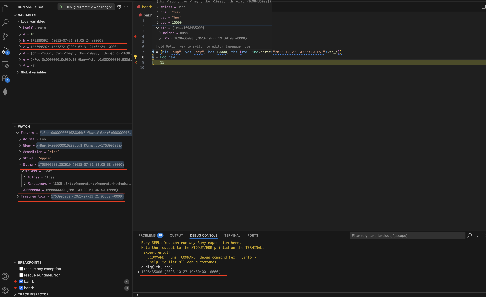

# rdbg-date-formatter README

This extension automatically formats Unix timestamps into human-readable dates while debugging Ruby code with the rdbg debugger.

This is particularly useful when debugging Ruby applications that work with timestamps, as it saves time from manually converting Unix timestamps to readable dates during debugging sessions. Instead of seeing 1577836800, you immediately see it represents New Year's Day 2020.


## Features

* Configurable Range: You can set minDate and maxDate in settings to avoid false positives
* Works with Variables Panel: Enhances variable display in the debugger
* Works with Evaluations: Also formats results from debug console evaluations
* Non-intrusive: Only adds formatting, doesn't change the actual values
* Enhances Debug Display: The original value is preserved but enhanced. For example:
Original: 1577836800
Enhanced: 1577836800 (2020-01-01 00:00:00 +0000)




## Requirements

Works in combination with [KoichiSasada.vscode-rdbg](https://marketplace.visualstudio.com/items?itemName=KoichiSasada.vscode-rdbg) extension.

## Extension Settings

You can modify the range for the values to be converted by changing configuration values:
```json 
    "configuration": {
      "title": "Settings for rdbg-date-formatter",
      "type": "object",
      "properties": {
        "rdbg-date-formatter.minDate": {
          "type": "integer",
          "default": 946684800,
          "description": "Minimum integer of seconds since the Epoch that should be considered as a date. Default value is /**2000.01.01*/ == 946684800"
        },
        "rdbg-date-formatter.maxDate": {
          "type": "integer",
          "default": 2208988800,
          "description": "Maximum integer of seconds since the Epoch that should be considered as a date. Default value is /**2071.09.08*/ == 2208988800" 
        }
      }
    }
``` 


